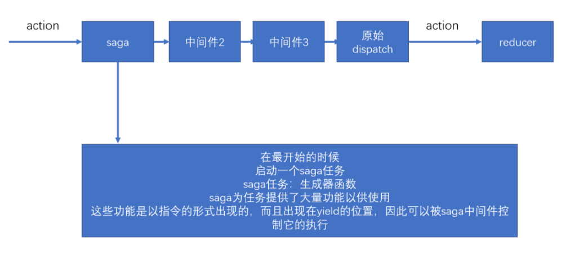

# redux-thunk

thunk允许action是一个带有副作用的函数，当action是一个函数被分发时，thunk会阻止action继续向后移交。

    - 在函数中进行相关的提交，这个中间件会对相关的函数进行处理，在函数之中书写我们自己的逻辑
    - 就是说如果发现action是一个函数，就会调用该中间件，否则就不作处理 

thunk会向函数中传递三个参数：

1. dispatch：来自于store.dispatch

2. getState：来自于store.getState

3. extra：来自于用户设置的额外参数

例子
```js
function incrementIfOdd() {
  return (dispatch, getState) => {
    const { counter } = getState();
 
    if (counter % 2 === 0) {
      return;
    }
 
    dispatch(increment());
  };
}
```
异步操作
也会等待完成
```js
function incrementIfOdd() {
  return async function(dispatch) => {
    await res = getResult()
    const action = geyMyaction()
    dispatch(action)
  };
}
```

也就是说这个中间件是在action中处理的

# redux-promise 

如果action是一个promise，则会等待promise完成，将完成的结果作为action触发，如果action不是一个promise，则判断其payload是否是一个promise，如果是，等待promise完成，然后将得到的结果作为payload的值触发。

简单的例子
```js
function incrementIfOdd() {
  return new Promise((resolve,reject) =>{
    // .....
  })
}
```

# redux-saga

解决副作用的 redux 中间件 
1. redux-thunk：需要改动action，可接收action是一个函数 
2. redux-promise：需要改动action，可接收action是一个promise对象，或action的payload是一个promise对象 
以上两个中间件，会导致action或action创建函数不再纯净。 
3. redux-saga将解决这样的问题，它不仅可以保持action、action创建函数、reducer的纯净，而且可以用模块化的方式解决副作用，并且功能非常强大。 redux-saga是建立在ES6的生成器基础上的，要熟练的使用saga，必须理解生成器。 要理解生成器，必须先理解迭代器和可迭代协议。

迭代器 阮一峰的es6 看了你就懂了



在saga任务中，如果yield了一个普通数据，saga不作任何处理，仅仅将数据传递给yield表达式（把得到的数据放到next的参数中），因此，在saga中，yield一个普通数据没什么意义。

**saga需要你在yield后面放上一些合适的saga指令（saga effects），如果放的是指令，saga中间件会根据不同的指令进行特殊处理，以控制整个任务的流程。**

每个指令本质上就是一个函数，该函数调用后，会返回一个指令对象，saga会接收到该指令对象，进行各种处理

一旦saga任务完成（生成器函数运行完成），则saga中间件一定结束

* take指令：【阻塞】监听某个action，如果action发生了，则会进行下一步处理，take指令仅监听一次。yield得到的是完整的action对象
* all指令：【阻塞】该函数传入一个数组，数组中放入生成器，saga会等待所有的生成器全部完成后才会进一步处理
* takeEvery指令：不断的监听某个action，当某个action到达之后，运行一个函数。takeEvery永远不会结束当前的生成器
* delay指令：【阻塞】阻塞指定的毫秒数
* put指令：用于重新触发action，相当于dispatch一个action
* call指令：【可能阻塞】用于副作用（通常是异步）函数调用
* apply指令：【可能阻塞】用于副作用（通常是异步）函数调用
* select指令：用于得到当前仓库中的数据
* cps指令：【可能阻塞】用于调用那些传统的回调方式的异步函数
* fork：用于开启一个新的任务，该任务不会阻塞，该函数需要传递一个生成器函数，fork返回了一个对象，类型为Task
* cancel：用于取消一个或多个任务，实际上，取消的实现原理，是利用generator.return。cancel可以不传递参数，如果不传递参数，则取消当前任务线。
* takeLastest：功能和takeEvery一致，只不过，会自动取消掉之前开启的任务
* cancelled：判断当前任务线是否被取消掉了
* race：【阻塞】竞赛，可以传递多个指令，当其中任何一个指令结束后，会直接结束，与Promise.race类似。返回的结果，是最先完成的指令结果。并且，该函数会自动取消其他的任务


