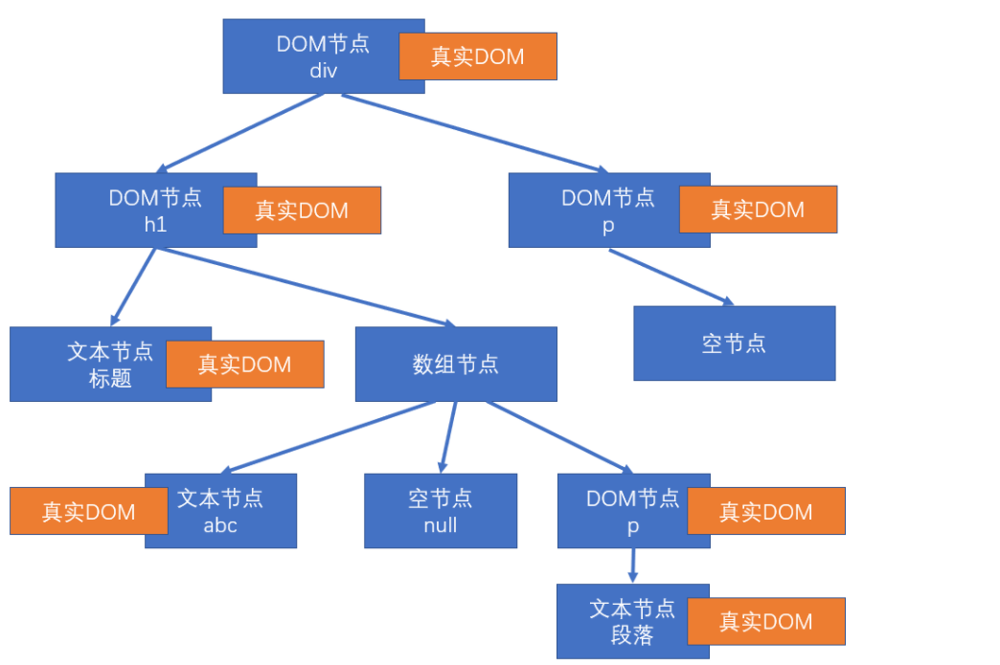
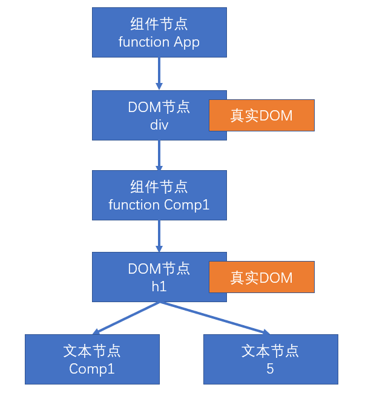

# 渲染原理

- React元素： React Element，通过React.createElement创建，jsx语法糖，本质上是一个对象
    - 例如
    - ```<div></div>``` 
    - ```<APP/>```

- React节点：专门用于渲染到UI界面的对象，React会通过React元素创建React节点
    - 节点类型
    - React DOM节点：创建该节点的React元素类型是一个```jsx```字符串
            - ```const test = <div></div>```
    - React 组件节点：创建该节点的React元素类型是一个函数或者是一个类
    - React TextNode节点：由字符串创建的字节
    - React 空节点：由null，false，undefined，true创建的节点
    - React 数组：由null，false，undefined创建的节点

- 真实DOM：通过document.createElement创建的dom元素

节点最后会变成真实的界面

## 首次渲染

1. 通过参数的值创建节点

2. 根据不同的节点做不同的事情

    - 文本节点：通过document.createTextNode创建真实的文本节点，生成真实dom

    - 空节点：什么都不做

    - 数组节点：遍历数组，将数组每一项递归创建节点（回到第一步反复进行操作，直到遍历结束，该数组节点不会生成真实的DOM节点，但是数组的每一项都会递归判断是不是可以创建的节点，从而生成真实生成真实dom

    - DOM节点：通过document.createElement创建真实的dom对象，然后遍历children递归操作，生成真实dom

    - 组件节点
        - 函数组件: **调用函数**，函数必须返回一个可以被创建的节点，然后根据返回值递归生成结果

        - 类组件
            - 1. 先创建该类的**实例**
            - 2. 然后调用对象的生命周期：static getDerivedStateFromProps
            - 3. 然后运行render方法，拿到节点对象（将该节点递归操作，回到第一步进行操作）
            - 4. 第三步完成之后，把该组件的componentDidMount加到执行队列中（先进先出，先进先执行）
            - 整个虚拟dom树全部构建完毕，把真实的dom对象中挂载到页面上时，执行该队列
              子组件的整个过程的完成一定是先于父组件的，父组件会在render全部完成之后就会进行第四步
              多个子元素会依次渲染完毕，一个子节点递归渲染完毕才会渲染下一个
    - 特殊的```<></>```算是一个函数组件节点

3. 第二步生成一颗虚拟dom树，把这个树保存起来（组件节点，空节点和数组节点也会在虚拟dom中）

4. 把之前生成的真实dom插入(除了空节点和)

例如以下DOM元素节点和数组节点
```js
const app = <div className="assaf">
    <h1>
        标题
        {["abc", null, <p>段落</p>]}
    </h1>
    <p>
        {undefined}
    </p>
</div>;
ReactDOM.render(app, document.getElementById('root'));
```

生成的虚拟DOM树



函数组件节点
```js
function Comp1(props) {
    return <h1>Comp1 {props.n}</h1>
}

function App(props) {
    return (
        <div>
            <Comp1 n={5} />
        </div>
    )
}

const app = <App />;
ReactDOM.render(app, document.getElementById('root'));
```



类组件节点
组件的实例会挂载到组件节点上
```js
class Comp1 extends React.Component {
    render() {
        return (
            <h1>Comp1</h1>
        )
    }
}

class App extends React.Component {
    render() {
        return (
            <div>
                <Comp1 />
            </div>
        )
    }
} 

const app = <App />;
ReactDOM.render(app, document.getElementById('root'));
```

## 更新节点

更新的场景

1. 重现调用React.render，完全重新生成节点树
    - 触发根节点更新
2. 在类组件中调用setState
    - 调用该方法的实例所在的节点更新，实例附着在组件节点上

**节点的更新**

- 如果调用的是React.render，进入根节点的对比(diff)更新

- 如果调用的是setState

    - 1. 运行生命周期函数 static getDerivedStateFromProps
    - 2. 运行shouldComponentUpdate，如果返回false，终止流程
    - 3. 运行render，得到一个新的节点，进入该节点的**对比更新**
    - 4. 将生命周期getSnapBeforeUpdate加入执行队列，以待将来执行
    - 5. 将生命周期componentDidUpdate加入执行队列，以待将来执行


后续步骤

首先更新虚拟dom树

1. 完成真实的DOM更新

2. 依次调用队列中的 conponentDidMount
    - 父组件不一致直接卸载，创建新的挂载

3. 依次调用队列中的 getSnapBeforeUpdate
    - 父组件一致重用一个新的，然后对比更新

4. 依次调用队列中的 componentDidUpdate
    - 父组件一致重用一个新的，然后对比更新

5. 依次调用队列中的 componentWillUnMount
    - 父组件不一致直接卸载，创建新的挂载

**对比更新**

将新产生的节点，对比之前虚拟dmo中的节点，发现差异，完成更新

React为了提高对比效率，做出如下假设

1. 假设节点不会出现层级移动
2. 不同的节点类型生成不同的结构
    - 相同的节点类型：节点本身类型相同，如果是组件节点，组件类型也必须相同
3. 多个兄弟节点通过唯一表示(key)来确定对比的新节点

key值的作用：用于通过旧节点，寻找对应的新节点，某个新节点进行插入的时候，会在旧节点中查找是否有key值相同的，如果有直接重用该节点

    - 渲染数组节点的时候必须要key值
    - 对于一系列相等的数组组件，如果我们没有加key值，可能在前面添加那么一个新组件被添加的时候可能会被加到最后

没有key值就按照顺序来，没有就按照顺序来

**找到了对比目标**

* 判断节点类型是否一致

**一致**

1.根据不同的节点类型，做不同的事情

* 空节点： 不作任何事情
* DOM节点
    - 只要是DOM节点一样，直接重用之前的真实DOM对象
    - 将其属性的变化记录下来，以待将来统一完成更新（现在不会真正的变化）
    - 遍历该新的React元素的子元素，重新递归对比更新
* 文本节点
    - 直接重用之前创建的文本节点对象
    - 将新的文本变化记录下来，将来统一完成更新
* 函数组件节点
    - 重新调用该函数，得到一个节点对象，继续进行递归对比更新
* 类组件
1. 重用之前的实例
2. 调用生命周期方法getDerivedStateFromProps
3. 调用生命周期方法shouldComponentUpdate 若该方法返回false直接终止
4. 运行render得到新的节点对象，进入递归对比更新，重新进入首步
5. 将生命期getSnapBeforeUpdate加入执行队列，以待将来执行
6. 将生命期componentDidUpdate加入执行队列，以待将来执行

**不一致**
* 创建新节点

整体上，先创建新的节点，然后卸载旧的节点，然后替换掉

* 卸载旧节点

1. 文本节点，Dom节点，数组节点，空节点，函数组件节点 直接扔掉当前的节点，然后创建新节点（和首次渲染的过程一样） 
2. 类组件节点
    - 直接卸载该节点
    - 调用该节点的compoentWillUnmount函数
    - 递归卸载子节点
    - 进入后续步骤


**没有找到了对比目标**

1. 新的DOM树中有节点被删除

1. 新的DOM树中有节点被添加

